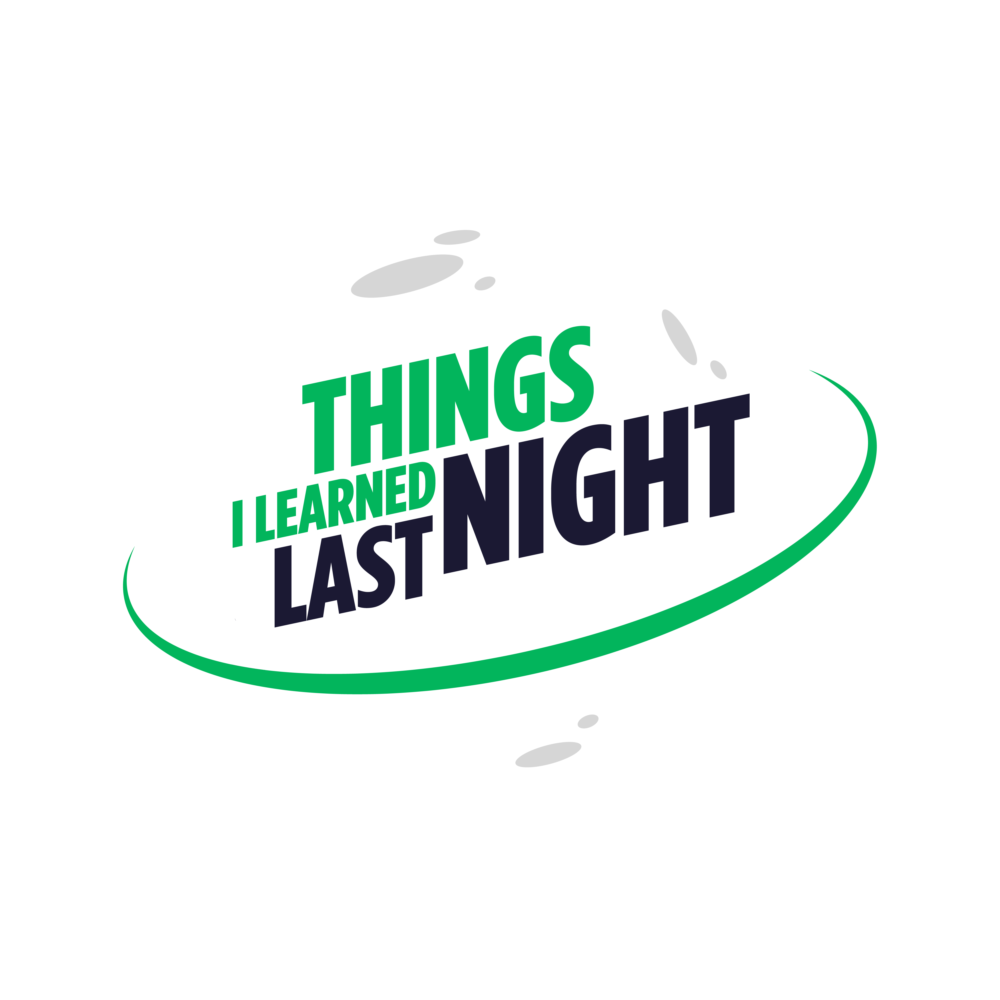

<h1 align="center">Hi, I'm Tim 👋</h1>

   
  <em>Support Engineer at <a href="https://matchboxdesigngroup.com">Matchbox Design Group</a></em>

   
  <em>Co-Founder of <a href="https://solarflaremedia.com">Solar Flare Media</a></em>

   
  <em>Podcaster at <a href="https://www.tilln.com">Things I Learned Last Night</a></em>

  <em>Currently building scalable WordPress + Laravel solutions at 
  <a href="https://matchboxdesigngroup.com">Matchbox Design Group</a></em>

  <strong>Tech stack:</strong> PHP · Blade · SCSS/Tailwind · React.js · MySQL · Nginx · DevOps

 

<ul>
  <li>🚀 10+ years in web development (100+ sites shipped & maintained)</li>
  <li>🎙️ Co-founder of <a href="https://solarflaremedia.com">Solar Flare Media</a> — podcasts & videos with 80M+ views</li>
  <li>🛠️ Passionate about accessibility, performance, and clean code</li>
  <li>🌱 Currently sharpening backend systems knowledge to round out my full-stack skills</li>
</ul>