<!-- Intro Section -->

<h2 align="center">
  Hi, I'm Tim 👋
  &nbsp;&nbsp;
  
</h2>

  <table border="0">
    <tr>
      <td align="center" width="250">
        
        <h3>Support Engineer</h3>
        

          <a href="https://matchboxdesigngroup.com">Matchbox Design Group</a>
        

      </td>
      <td align="center" width="250">
        
        <h3>Co-Founder</h3>
        

          <a href="https://solarflaremedia.com">Solar Flare Media</a>
        

      </td>
      <td align="center" width="250">
        
        <h3>Podcaster</h3>
        

          <a href="https://www.tilln.com">Things I Learned Last Night</a>
        

      </td>
    </tr>
  </table>

  <em>Currently supporting scalable WordPress + Laravel solutions at 
  <a href="https://matchboxdesigngroup.com">Matchbox Design Group</a></em>

 

<ul>
  <li>🚀 10+ years in web development (100+ sites shipped & maintained)</li>
  <li>🛠️ Passionate about accessibility, performance, and clean code</li>
  <li>🌱 Currently sharpening backend systems knowledge to round out my full-stack skills</li>
  <li>🎙️ Co-founder of <a href="https://solarflaremedia.com">Solar Flare Media</a> — podcasts & videos with 80M+ views</li>
</ul>

<!-- Tech Stack Section -->

<h2 align="center">🛠️ Tech Stack</h2>

   
  
  
  
  
  
  
  
  
  
  
  
  
  
  
  
  
  
  
  
  
  

<!-- Stats Section -->

<h2 align="center">📊 GitHub Stats</h2>

  <!-- Streaks -->
  
  
    

  <!-- Activity Graph -->
  

<h2 align="center">📊 Highlights</h2>

  

